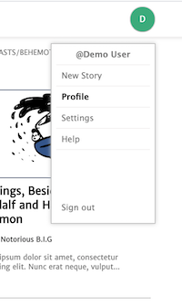
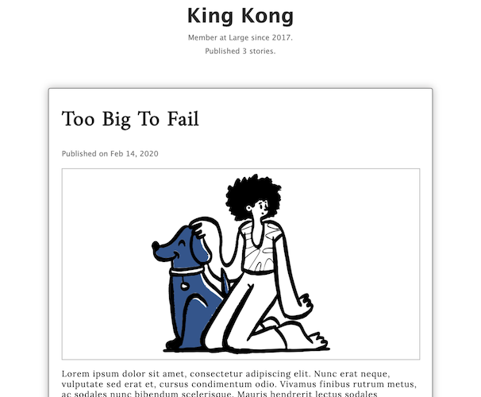
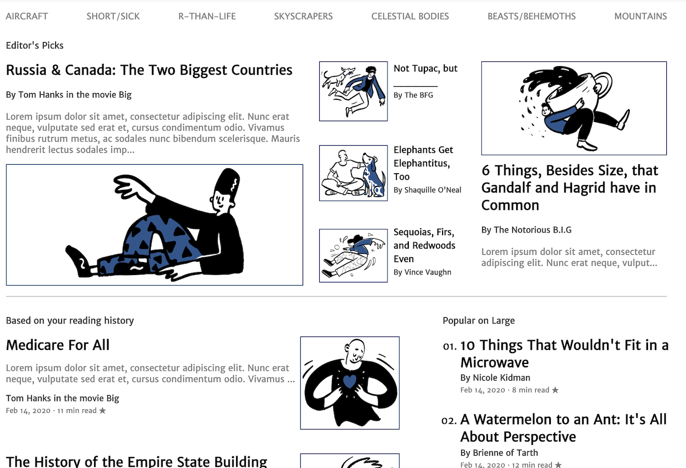

# Large 
Large is a clone of the story-sharing site 'Medium'. This single-page application allows users to publish their own stories, and to read and respond to others' stories. Take a look at the [live version](https://large-aa.herokuapp.com/). 
* 
## Technologies 
Large's backend is built with Ruby on Rails for database management. The frontend is built with a React component framework, Redux for state management, and JavaScript for a smooth, single-page user experience. 
* JQuery AJAX calls are used for all database requests, and Jbuilder views are used to convert returned Ruby instances into JavaScript objects. 
* An AWS integration is used to store and retrieve story cover images and thumbnails. 

## Features 
### User Authentication
  * Large maintains both frontend and backend user authentication. Client-side validations and errors prevent unnecessary database requests. 
  * A modal is used to present login and signup forms. 
   * 
   * 
  * User Profile
    * * Users can visit their own or others' profile pages to view authored stories. 
  *  
### Stories
  * Index: page is divided up into a 'Recommended by the Editors", "Based on your reading history", and "Popular on Large". The "Popular" section is sticky as the user scrolls down the feed.
  *  
  Show
  * 
  * New: form asks users for story title, body, and cover image. Client-side validations prevent user from submitting a story without all three pieces. 
  
  
  
 ### Responses: Response list is displayed in reverse chronological order, and include the user's username, as well as the date the response was created. New responses are immediately displayed at the top of the list. 
  * Using props to check if the current user is the response author, React component displays a   delete button on those responses written by the current user. 
  * 

### Future Features 
* Follows
  * users can follow writers they like to curate a filtered story feed
* Response 'likes' 
  * users can respond to story responses by 'liking' them
* Category tags 
  * stories can be tagged with specific categories to generate category-specific feeds

